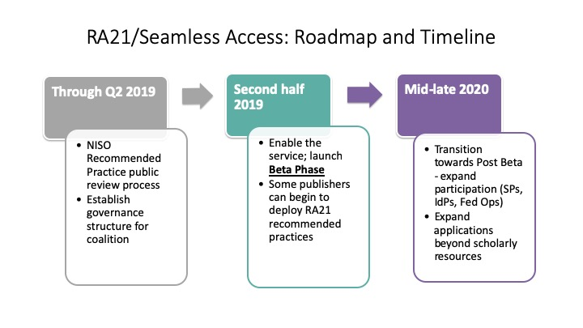

SeamlessAccess.org is a service designed to help foster a more streamlined online access experience when using scholarly collaboration tools, information resources, and shared research infrastructure. The service promotes digital authentication leveraging an existing single-sign-on infrastructure through one’s home institution, while maintaining an environment that protects personal data and privacy. 

SeamlessAccess.org aims to enable simple, trusted use of scholarly resources and services anytime, anywhere, and on any device.

Governance of this service is through the Coalition for Seamless Access, a collaboration between five organizations--[GÉANT](https://geant.org), [Internet2](https://internet2.edu), the National Information Standards Organization ([NISO](https://niso.org)),[ORCID](https://orcid.org), and the International Association of STM Publishers ([STM](https://stm-assoc.org)).

## About GÉANT
GÉANT is Europe’s leading collaboration on network and related infrastructure and services for the benefit of research and education, contributing to Europe's economic growth and competitiveness. The organisation develops, delivers and promotes advanced network and associated e-infrastructure services, and supports innovation and knowledge-sharing amongst its members, partners and the wider research and education networking community. 

## About Internet2
Internet2® is a non-profit, member-driven advanced technology community founded by the nation’s leading higher education institutions in 1996. Internet2 delivers a diverse portfolio of technology solutions that leverages, integrates, and amplifies the strengths of its members and helps support their educational, research and community service missions. Internet2’s core infrastructure components include the nation’s largest and fastest research and education network that was built to deliver advanced, customized services that are accessed and secured by the community-developed trust and identity framework. 

## About NISO
NISO, based in Baltimore, MD, fosters the development and maintenance of standards that facilitate the creation, persistent management, and effective interchange of information so that it can be trusted for use in research and learning. To fulfill this mission, NISO engages libraries, publishers, information aggregators, and other organizations that support learning, research, and scholarship through the creation, organization, management, and curation of knowledge. NISO works with intersecting communities of interest and across the entire lifecycle of information standards. NISO is a not-for-profit association accredited by the American National Standards Institute (ANSI). 

## About ORCID
ORCID’s vision is a world where all who participate in research and innovation, from imagining to building and managing, are uniquely identified and connected to their contributions across disciplines, and borders, and time. ORCID provides an identifier for individuals to use with their name as they engage in research and innovation activities. We provide open tools that enable transparent and trustworthy connections between researchers, their contributions, and affiliations. We provide this service to help people find information and to simplify reporting and analysis.

## About STM
STM is the leading global trade association for academic and professional publishers. It has over 150 members in 21 countries who each year collectively publish nearly 66% of all journal articles and tens of thousands of monographs and reference works. STM members include learned societies, university presses, both subscription and open access publishers, new starts, and established players.  

 
