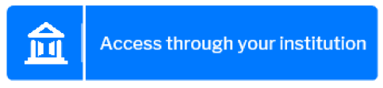
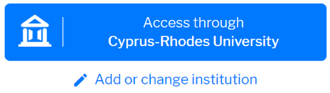

# SeamlessAccess.org = simple, trusted use of scholarly resources and services anytime, anywhere, and on any device.

Seamless Access is the new, convenient way to access digital scholarly content and services that builds on the [guidelines](https://www.niso.org/publications/rp-27-2019-ra21) resulting from the Resource Access in the 21st Century ([RA21](https://ra21.org)) initiative. It sets a standard for digital authentication based on a single sign on through your own home institution.

With Seamless Access, your personal data are well protected and can never be used for commercial tracking. The Coalition for Seamless Access is a non-profit initiative by scholars for scholars.
Now you can seamlessly find and use content and services outside your institution network anytime, anywhere, and on any device. Research as it should be!

## A Modern and Reliable Approach to Resource Access
Ensure access to your resources and services to those entitled to have it. It is increasingly complex to identify legitimate users. Seamless Access enables access using individual’s federated authentication (sign on.) This privacy-preserving model simplifies access for end users while maintaining institutional control over what information is shared with content, resource and service providers.

## Proven User Experience
The Seamless Access solution has been led through extensive usability testing by UI/UX experts to ensure the best experience for your users. It remembers your user’s last sign on choice, simplifies institution search, and uses clear language and images to meet user expectations.

## Single Sign On… For Real!
Seamless Access enables true Single Sign On. Your users will be able to sign in using their preferred sign in credentials (for example, those from their institution), and will not be bothered for them again for all Seamless Access-enabled sites.

### The first time

### Every other time

## Free & Flexible
No cost to use Seamless Access? Flexible implementation that works with your existing site design? Straight-forward implementation? What are you waiting for?! See the implementation guide below to understand the high-level steps, and contact Laura at laura@SeamlessAccess.org for a Getting Started Consultation to help plan your path to Seamless Access. Research as it should be.
